# FABLE OMEGA

**Multi-tenant Telegram scenario runtime · 445 catalogue scenarios verified · 15 strategic hubs · one async control plane**

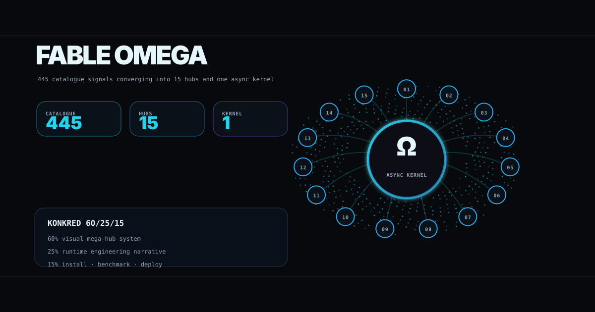

FABLE OMEGA turns a large Telegram bot idea catalogue into a single shared runtime: scenario definitions are indexed, routed through strategic hubs, simulated through a FastAPI dashboard and verified by committed test reports. The presentation follows the KONKRED **60/25/15** standard: visual system first, runtime engineering second, installation and deployment third.

| Current verified metric | Value | Evidence |
|---|---:|---|
| Catalogue scenarios indexed | 445 | `src/core/omni_catalog.py` |
| Strategic hubs | 15 | `src/core/hub_router.py` |
| **445 catalogue scenarios verified** | 445/445 passed | [tests/FULL_FLEET_TEST_REPORT.json](tests/FULL_FLEET_TEST_REPORT.json) |
| Fleet lifecycle success rate | 100.0% | [tests/FULL_FLEET_TEST_REPORT.json](tests/FULL_FLEET_TEST_REPORT.json) |
| Low-resource benchmark throughput | 422.63 req/s | [tests/LOW_RESOURCE_BENCHMARK_REPORT.json](tests/LOW_RESOURCE_BENCHMARK_REPORT.json) |
| Benchmark RSS under load | 54.98 MB | [tests/LOW_RESOURCE_BENCHMARK_REPORT.json](tests/LOW_RESOURCE_BENCHMARK_REPORT.json) |

The verified number is a catalogue/runtime compatibility metric backed by the committed fleet report.

---

## 60% · visual mega-hub system

### Catalogue scale and source mix

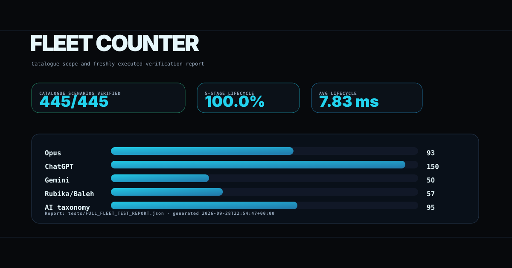

| Catalogue source | Entries |
|---|---:|
| Opus full-code blueprints | 93 |
| ChatGPT playbooks | 150 |
| Gemini market landscape | 50 |
| Rubika/Baleh local suite | 57 |
| AI business taxonomy | 95 |
| **Total** | **445** |

### Fifteen-hub strategy

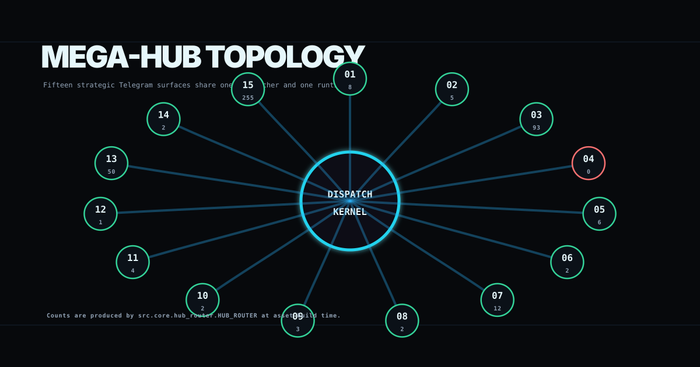

The hub model reduces per-scenario process sprawl. Each hub is a product surface; each scenario remains a catalogue entry that can be resolved by the dispatcher and simulated through the shared runtime.

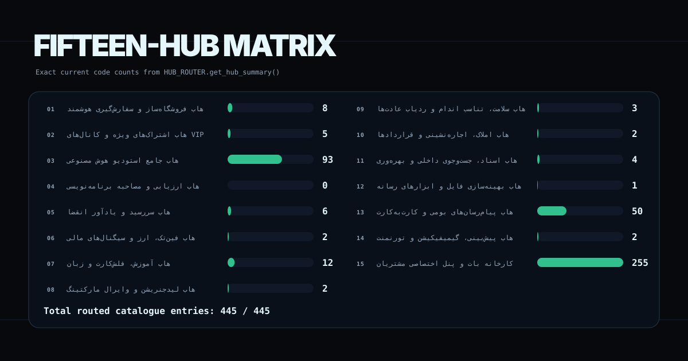

| # | Hub key | Strategic hub | Runtime category | Proposed handle | Exact code count |
|---:|---|---|---|---|---:|
| 01 | `hub_01_commerce` | هاب فروشگاه‌ساز و سفارش‌گیری هوشمند | E-Commerce & Retail | `@Omni_Commerce_SuperBot` | 8 |
| 02 | `hub_02_vip_paywalls` | هاب اشتراک‌های ویژه و کانال‌های VIP | Membership & Monetization | `@Omni_Paywall_SuperBot` | 5 |
| 03 | `hub_03_ai_studio` | هاب جامع استودیو هوش مصنوعی | AI & Automation | `@Omni_AI_Studio_SuperBot` | 93 |
| 04 | `hub_04_coding_katas` | هاب ارزیابی و مصاحبه برنامه‌نویسی | Developer Tools | `@Omni_Kata_Runner_SuperBot` | 0 |
| 05 | `hub_05_b2b_compliance` | هاب سررسید و یادآور انقضا | B2B & Enterprise | `@Omni_Compliance_SuperBot` | 6 |
| 06 | `hub_06_fintech_crypto` | هاب فین‌تک، ارز و سیگنال‌های مالی | FinTech & Crypto | `@Omni_Fintech_SuperBot` | 2 |
| 07 | `hub_07_education_learning` | هاب آموزش، فلش‌کارت و زبان | Education & EdTech | `@Omni_Edu_Master_SuperBot` | 12 |
| 08 | `hub_08_growth_leadgen` | هاب لیدجنریشن و وایرال مارکتینگ | Marketing & Growth | `@Omni_Growth_SuperBot` | 2 |
| 09 | `hub_09_health_fitness` | هاب سلامت، تناسب اندام و ردیاب عادت‌ها | Health & Lifestyle | `@Omni_Health_Habit_SuperBot` | 3 |
| 10 | `hub_10_real_estate_rental` | هاب املاک، اجاره‌نشینی و قراردادها | Real Estate & CRM | `@Omni_RealEstate_SuperBot` | 2 |
| 11 | `hub_11_productivity_search` | هاب اسناد، جست‌وجوی داخلی و بهره‌وری | Productivity & Tools | `@Omni_Doc_Search_SuperBot` | 4 |
| 12 | `hub_12_media_optimization` | هاب بهینه‌سازی فایل و ابزارهای رسانه | Media & Design | `@Omni_Media_Studio_SuperBot` | 1 |
| 13 | `hub_13_rubika_baleh_local` | هاب پیام‌رسان‌های بومی و کارت‌به‌کارت | Local Messengers & Iran | `@Omni_Local_Iran_SuperBot` | 50 |
| 14 | `hub_14_gamification_leagues` | هاب پیش‌بینی، گیمیفیکیشن و تورنمنت | Gaming & Engagement | `@Omni_Game_League_SuperBot` | 2 |
| 15 | `hub_15_agency_factory` | کارخانه بات و پنل اختصاصی مشتریان | Enterprise & White-Label | `@Omni_Agency_Factory_SuperBot` | 255 |

Counts above are generated from `HUB_ROUTER.get_hub_summary()` and sum to **445**. The current router intentionally sends unmatched catalogue entries to the Agency Factory fallback, which is why Hub 15 carries the largest count.

### Dispatcher rails

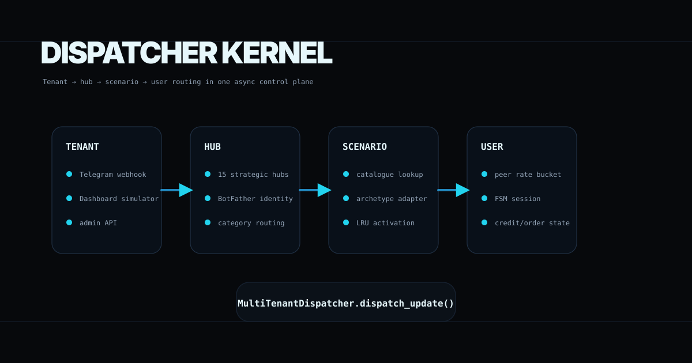

The dispatcher receives a tenant surface, selects the hub, resolves the scenario or reusable archetype, applies per-peer rate admission and executes the bot handler against normalized user state.

### Lifecycle console

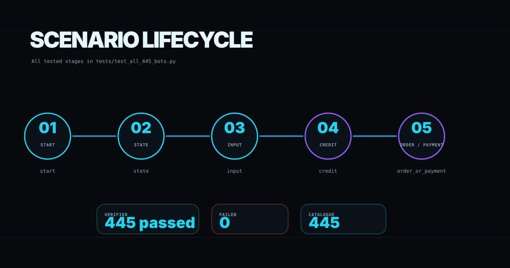

The full-fleet report exercises five lifecycle stages for every catalogue entry: `start`, `state`, `input`, `credit` and `order_or_payment`.

### Runtime memory rack

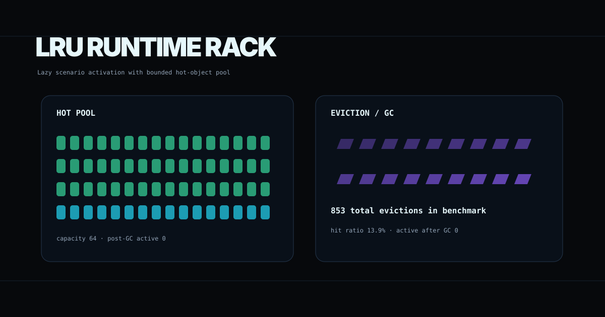

The LRU pool keeps frequently used scenario objects hot and evicts inactive objects. The fresh benchmark used a max active pool of **64** with **853** total evictions recorded in [LOW_RESOURCE_BENCHMARK_REPORT.json](tests/LOW_RESOURCE_BENCHMARK_REPORT.json).

### SQLite WAL state flow

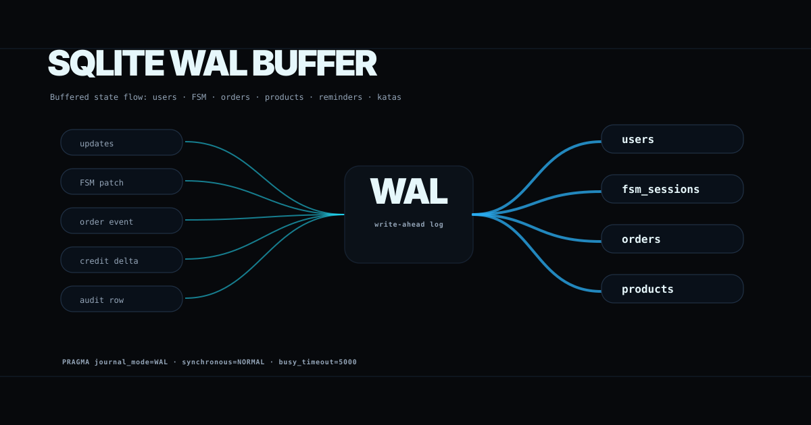

SQLite is configured with WAL-oriented pragmas in `src/core/database.py` and stores users, FSM sessions, orders, products, reminders and kata definitions.

### Monetization rail

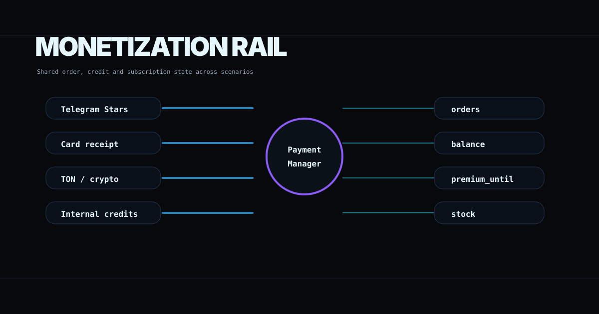

`PaymentManager` centralizes order creation, approval, rejection, credit top-ups, VIP subscription state and product stock transitions so scenarios do not fork separate billing logic.

### Control-plane surface

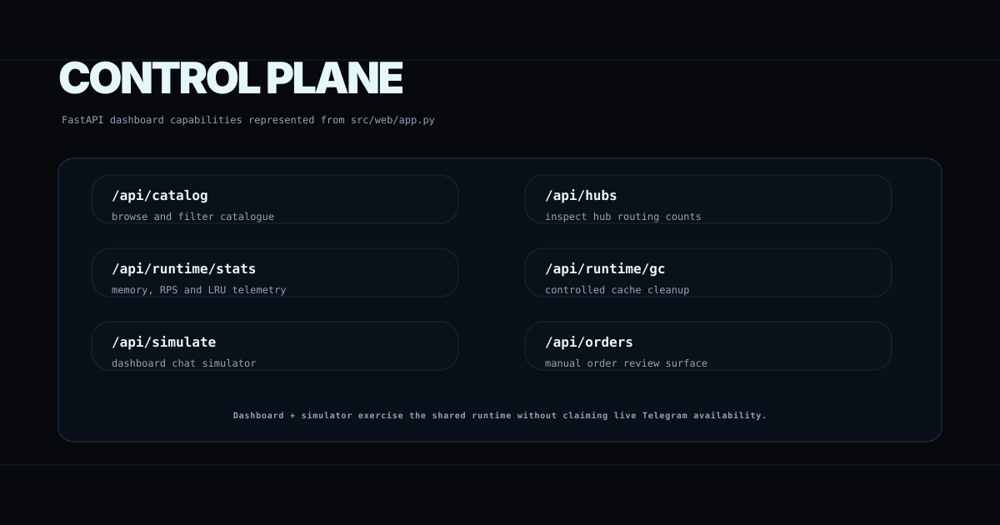

The dashboard and API are implemented in `src/web/app.py`. Real capabilities include catalogue browsing, hub inspection, runtime telemetry, controlled cache cleanup, order review and a browser-based simulator.

### Telemetry HUD

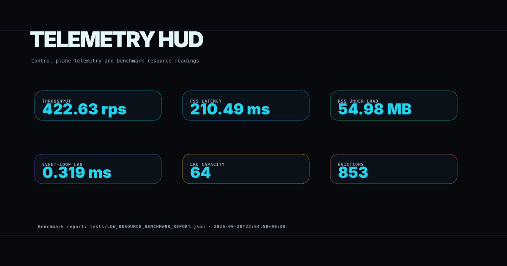

Runtime telemetry is exposed through `/api/runtime/stats` and benchmarked through `tests/test_low_resource_runtime.py`.

---

## 25% · technical runtime narrative

### Scenario vs archetype vs hub vs runtime

| Concept | Runtime meaning |
|---|---|
| Scenario | A catalogue entry with title, source, category, pricing and workflow metadata. |
| Archetype | A reusable bot implementation pattern, such as commerce, paywall, AI gateway, kata runner, license reminder or dynamic generic service. |
| Hub | A strategic product surface grouping scenarios behind a proposed Telegram handle. |
| Runtime | The shared async process that performs dispatch, FSM state, rate limiting, monetization, telemetry and persistence. |

### Async dispatcher and dynamic bot engine

`src/core/dispatcher.py` exposes `MultiTenantDispatcher.dispatch_update(bot_id, update, bypass_rate_limit=False)`. Dedicated scenarios use concrete bot classes from `src/bots/`; all other catalogue entries are handled by `DynamicArchetypeBot`, which reads the scenario spec from `OMNI_CATALOG` and presents the same core lifecycle.

Request path:

```text
Telegram or dashboard update
  -> MultiTenantDispatcher
  -> TokenBucketRateLimiter
  -> dedicated bot or DynamicArchetypeBot
  -> AsyncFSM session
  -> PaymentManager / DB when required
  -> normalized response payload
```

### FSM and persistence

`AsyncFSM` stores per-user state in the `fsm_sessions` table and keeps an in-memory session cache for the active process. State transitions write through `AsyncDatabase`, which opens SQLite connections with WAL, `synchronous=NORMAL`, `busy_timeout=5000`, memory temp store and foreign keys enabled.

### Rate limiting

`TokenBucketRateLimiter` enforces shared global admission and per-peer buckets. Tests can bypass rate limiting explicitly, which is recorded in benchmark test parameters.

### Low-resource execution

The low-resource benchmark dispatches **1000** requests at concurrency **50** across the 445-entry catalogue. Fresh report values:

| Benchmark metric | Value | Report |
|---|---:|---|
| Success rate | 99.6% | [LOW_RESOURCE_BENCHMARK_REPORT.json](tests/LOW_RESOURCE_BENCHMARK_REPORT.json) |
| Throughput | 422.63 req/s | [LOW_RESOURCE_BENCHMARK_REPORT.json](tests/LOW_RESOURCE_BENCHMARK_REPORT.json) |
| Average latency | 117.02 ms | [LOW_RESOURCE_BENCHMARK_REPORT.json](tests/LOW_RESOURCE_BENCHMARK_REPORT.json) |
| P95 latency | 210.49 ms | [LOW_RESOURCE_BENCHMARK_REPORT.json](tests/LOW_RESOURCE_BENCHMARK_REPORT.json) |
| Event-loop lag | 0.319 ms | [LOW_RESOURCE_BENCHMARK_REPORT.json](tests/LOW_RESOURCE_BENCHMARK_REPORT.json) |
| RSS under load | 54.98 MB | [LOW_RESOURCE_BENCHMARK_REPORT.json](tests/LOW_RESOURCE_BENCHMARK_REPORT.json) |
| Post-GC RSS | 54.89 MB | [LOW_RESOURCE_BENCHMARK_REPORT.json](tests/LOW_RESOURCE_BENCHMARK_REPORT.json) |

### Benchmark environment

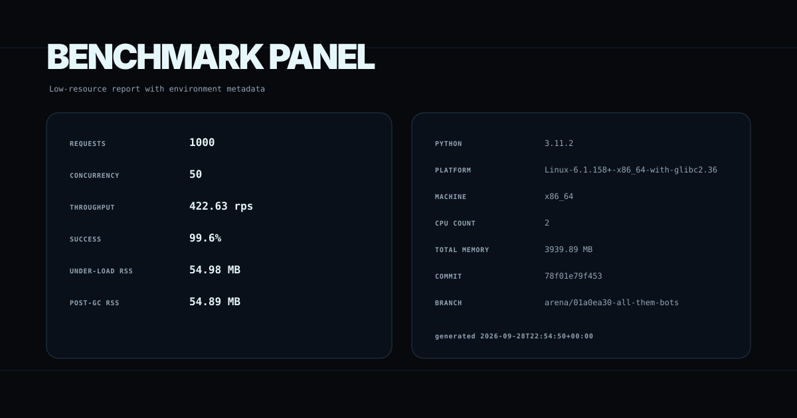

| Environment field | Recorded value |
|---|---|
| Generated UTC | `2026-09-28T22:54:50+00:00` |
| Python | `3.11.2 (CPython)` |
| Platform | `Linux-6.1.158+-x86_64-with-glibc2.36` |
| Machine / CPU count | `x86_64` / `2` |
| Memory | `3939.89 MB total`, `3629.16 MB available at report time` |
| Git | `arena/01a0ea30-all-them-bots` @ `78f01e79f453` |

### Verification console

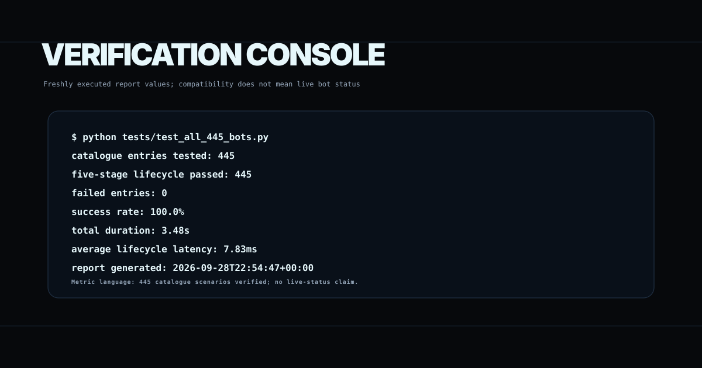

Fresh fleet verification from [FULL_FLEET_TEST_REPORT.json](tests/FULL_FLEET_TEST_REPORT.json):

| Fleet verification metric | Value |
|---|---:|
| Total catalogue entries tested | 445 |
| Passed five-stage lifecycle | 445 |
| Failed | 0 |
| Success rate | 100.0% |
| Total duration | 3.48 s |
| Average lifecycle latency | 7.83 ms |

### Dashboard and simulator API

The FastAPI app exposes:

| Route | Purpose |
|---|---|
| `GET /` | Dashboard HTML and simulator UI |
| `GET /healthz` | SQLite and application health probe |
| `GET /api/catalog` | Complete catalogue and source breakdown |
| `GET /api/hubs` | Fifteen hub definitions and code counts |
| `GET /api/hubs/{hub_key}/bots` | Scenarios routed into one hub |
| `GET /api/runtime/stats` | Memory, RPS, LRU and write-buffer telemetry |
| `POST /api/runtime/gc` | Flush write buffer and purge cached scenario objects |
| `POST /api/runtime/tune` | Adjust LRU capacity and write-buffer interval |
| `POST /api/simulate` | Send a simulated message or callback into the dispatcher |
| `GET /api/orders` | Latest order records |
| `POST /api/orders/{order_id}/approve` | Approve an order |
| `POST /api/orders/{order_id}/reject` | Reject an order |
| `POST /webhook/{bot_id}` | Webhook ingress for a configured bot id |

---

## 15% · installation, benchmarking and deployment

### Install from a clean environment

```bash
python3 -m venv .venv
. .venv/bin/activate
python -m pip install --upgrade pip setuptools wheel
python -m pip install -e '.[dev]'
```

The package metadata is aligned with the runtime:

```bash
fable-omega --host 0.0.0.0 --port 8000
```

The repository launcher remains available:

```bash
python run.py --host 0.0.0.0 --port 8000
```

### Reproduce verification and benchmark reports

```bash
ruff check src tests tools
pytest -q
python tests/test_all_445_bots.py
python tests/test_low_resource_runtime.py
python tools/readme/build_assets.py
python tools/readme/verify_assets.py
```

Report schema validation is covered by `tests/test_report_schemas.py`. Package metadata regression checks are covered by `tests/test_package_metadata.py`.

### FastAPI startup smoke test

```bash
python -m uvicorn src.web.app:app --host 0.0.0.0 --port 8000
curl http://127.0.0.1:8000/healthz
curl http://127.0.0.1:8000/api/catalog
curl http://127.0.0.1:8000/api/hubs
curl http://127.0.0.1:8000/api/runtime/stats
```

### Deployment stack

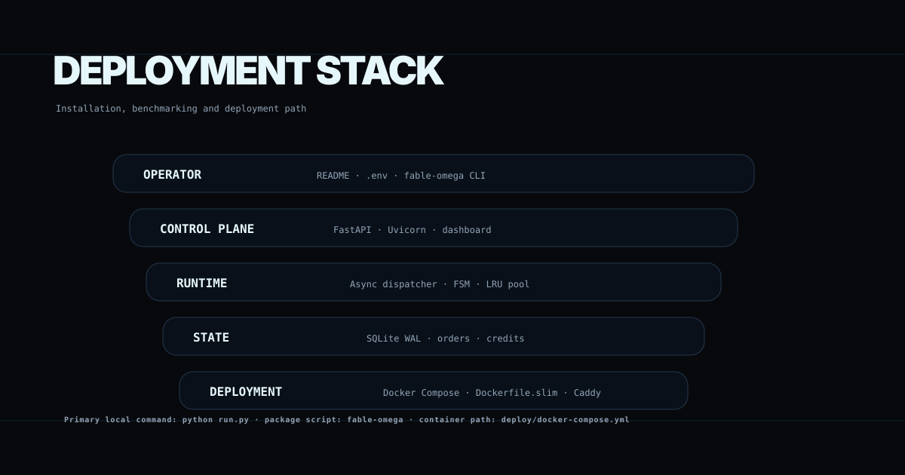

Docker Compose template:

```bash
docker compose -f deploy/docker-compose.yml config
docker compose -f deploy/docker-compose.yml up -d
```

Container build when Docker is available:

```bash
docker build -f deploy/Dockerfile.slim -t fable-omega:local .
```

### Directory structure

```text
.
├── README.md
├── MEGA_HUB_ARCHITECTURE_BLUEPRINT.md
├── pyproject.toml
├── requirements.txt
├── run.py
├── assets/readme/
│   ├── hero-omega.svg
│   ├── fleet-counter.svg
│   ├── mega-hub-topology.svg
│   ├── fifteen-hub-matrix.svg
│   ├── dispatcher-kernel.svg
│   ├── scenario-lifecycle.svg
│   ├── lru-runtime.svg
│   ├── sqlite-wal.svg
│   ├── monetization-rail.svg
│   ├── control-plane.svg
│   ├── telemetry-hud.svg
│   ├── verification-console.svg
│   ├── benchmark-panel.svg
│   ├── deployment-stack.svg
│   └── footer-omega.svg
├── tools/readme/
│   ├── build_assets.py
│   └── verify_assets.py
├── src/
│   ├── cli.py
│   ├── bots/
│   ├── core/
│   └── web/
├── tests/
│   ├── test_all_445_bots.py
│   ├── test_low_resource_runtime.py
│   ├── test_catalogue_counts.py
│   ├── test_package_metadata.py
│   ├── test_report_schemas.py
│   ├── FULL_FLEET_TEST_REPORT.json
│   └── LOW_RESOURCE_BENCHMARK_REPORT.json
└── deploy/
    ├── Dockerfile.slim
    ├── Dockerfile
    ├── docker-compose.yml
    └── run_optimized.sh
```

### Operations

1. Keep tokens and payment credentials in environment variables or a secret manager; never commit `.env`.
2. Use the simulator and full-fleet test before binding a real Telegram token.
3. Start with one hub, verify webhook behavior, then expand by measured hub demand.
4. Use `/api/runtime/stats` for live process telemetry and `/api/runtime/gc` for controlled cache cleanup.
5. Re-run the fleet and low-resource reports after runtime changes.
6. Regenerate README assets after any catalogue, hub routing, benchmark or dashboard change.
7. Treat payment approvals, receipt review and balance mutation as auditable state transitions.
8. Validate platform rules and BotFather limits during deployment planning.

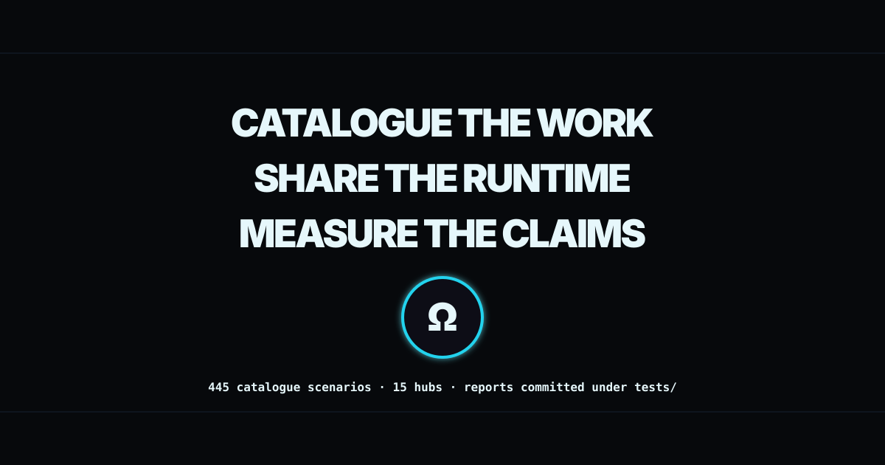
